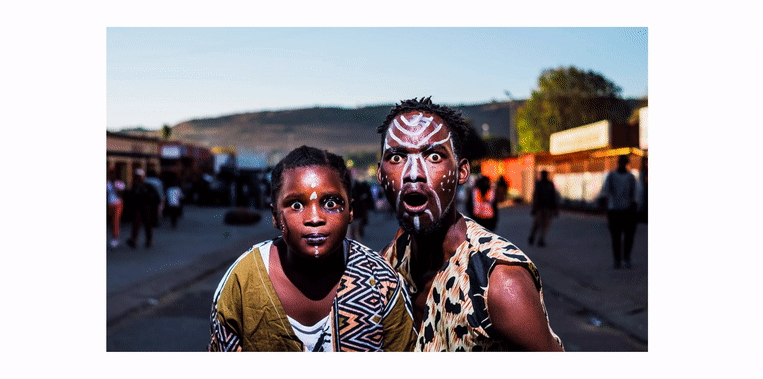

### Testing image Reveal with GSAP

## WARNING!

#### I Decided to change the original settings of the scss for this project

<p>Because for some reason i wasnt getting the effect like in the tutorial , where
you could center the image with width: 1440px ... etc i will add the comments inside the App.js</p>

<br>

[](https://nadiamariduena.github.io/animated-portfolio-with-intersection-observer/)

<br>
<br>

##### Preview

```javascript
useEffect(() => {
  tl.to(container, 1, {
    css: { visibility: "visible" },
  })
    .to(imageReveal, 1.4, { width: "0%", ease: Power2.easeInOut })
    .from(image, 1.4, { scale: 1.6, ease: Power2.easeInOut, delay: -1.5 });
});
```
